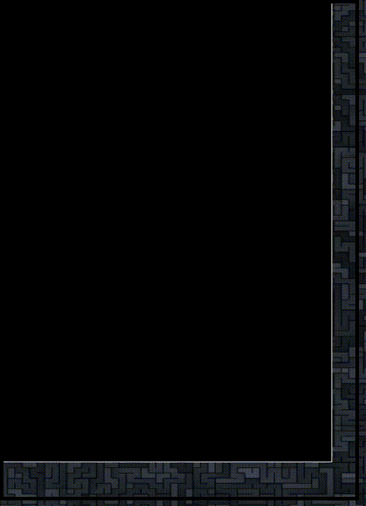

# C-Cgol
A highly-interactional Conway's Game of Life written in C for the X11 window system

Works on most Linux distributions!

# Installing

`mkdir gull`

`cd gull`

`git clone https://github.com/mllegoman/C-Cgol`

# Getting Started

To start you will have two directories - bin and src. In bin/ you will find the precompiled binary, and in src/ you will find w.x.c (the source code).

To run, go to your terminal and type:

`cd bin`

`./cgol`

If you wish to install this system-wide you can always throw the binary in /usr/local/bin:

`cp cgol /usr/local/bin/cgol`

Or wherever you feel comfortable putting your binaries.

# Compiling

`mkdir gull`

`cd gull`

`git clone https://github.com/mllegoman/C-Cgol`

`cd C-Cgol/src`

`gcc -xc w.x.c -o cgol -lX11 -lpthread`

# Usage
When starting cgol you will first be prompted with "edit mode". Here you can set the domain of the grid (size), as well as other key elements such as:

## random data:

pressing the "r" key will yield you the ability to summon random chunks on demand!

## paste-buffer:

pressing the "p" key will give you the power to summon any pattern you like!

(press anywhere on the window OR select the "q" key to escape the pattern draw)

# Some Example Usage

# Todo

Add support for macOS and maybe Windows

